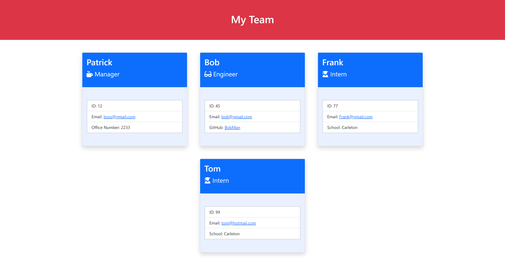

# 10 Object-Oriented Programming: Team Profile Generator

## Description
This is a Node.js command-line application that takes in information about employees on a software engineering team and generates an HTML webpage that displays summaries for each person. Because testing is key to making code maintainable, I've also written unit tests for each part of my code and ensured that it also passed all of them.

&nbsp;

---
## User Story

```md
AS A manager
I WANT to generate a webpage that displays my team's basic info
SO THAT I have quick access to their emails and GitHub profiles
```

&nbsp;

---
## Installation

The User should clone the repository from GitHub and download Node.js.  
In the command-line, you will need to enter the following commands;
* npm install
* npm install inquirer
* npm install Jest
 
&nbsp;

---
## Usage

Enter ***node index.js*** in the command-line, from the root folder of the project.  You will then be prompted to answer a series of questions to create your team.  After you have answered all the question prompts, you will find your created team HTML file in the **dist** folder.

&nbsp;

---
## Links

[GitHub Repository](https://github.com/MorningSol/team-profile-generator)
 
&nbsp;

---
## Demonstration Video

https://user-images.githubusercontent.com/98545619/169610130-d70e6a1d-5d6b-4a37-b7f3-ca26cb089855.mp4

&nbsp;

---
## Created Team Profile Sample

&nbsp;


A generated team profile sample can be found in the **dist** folder.
